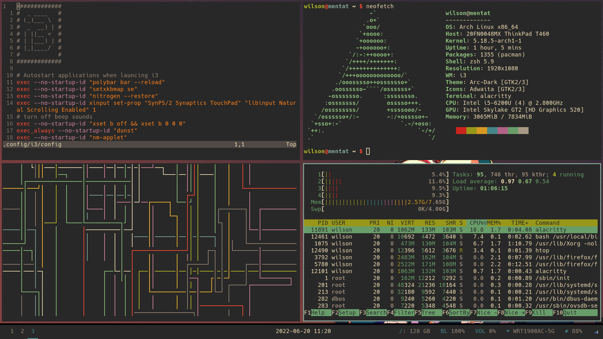

# dotfiles
Backup of my configuration files for my Linux system.

First Linux-install:
> Wed Jun 13 16:57:06 2018

Preview from 2019-05-06

## Setup
- distro: **Arch**
- window manager: **i3-gaps**
- status bar: **polybar**
- color scheme: **Gruvbox**:green_heart:

## Some tools I use
- terminal emulator: **termite**
- text editor: **spacemacs**
- file manager: **ranger**
- web browser: **firefox**
- application launcher: **rofi**
- pdf reader: **zathura**
